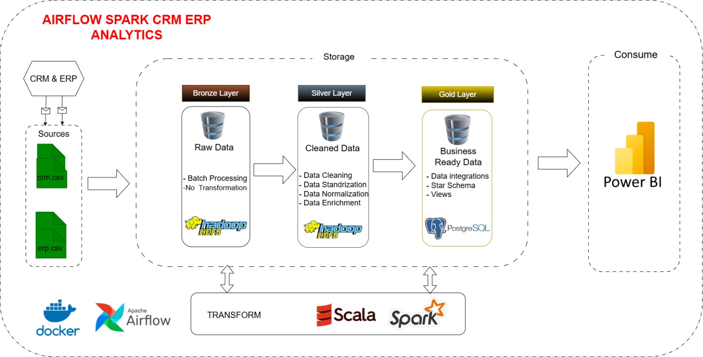
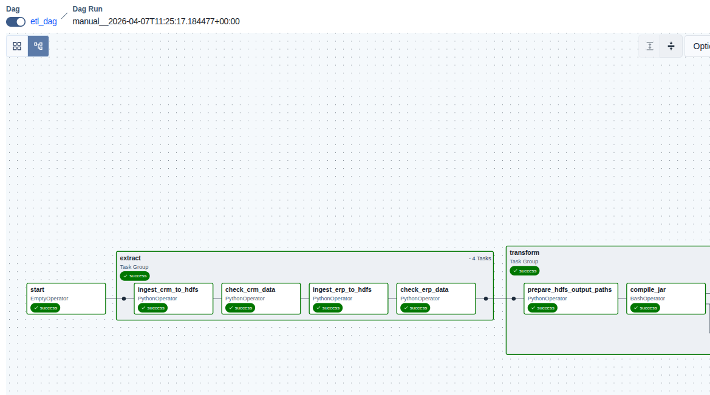
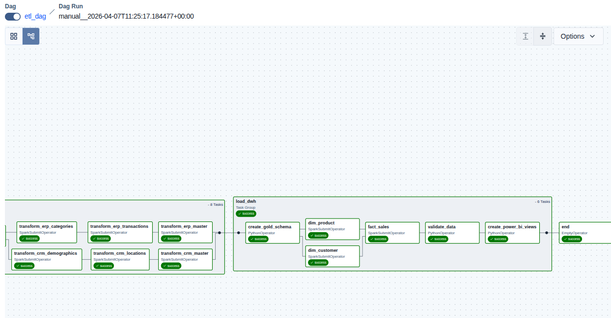
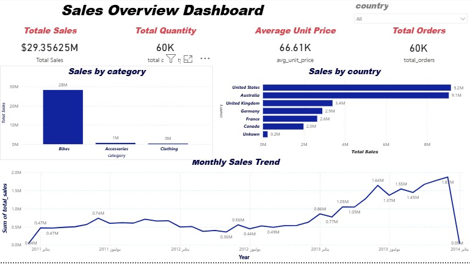
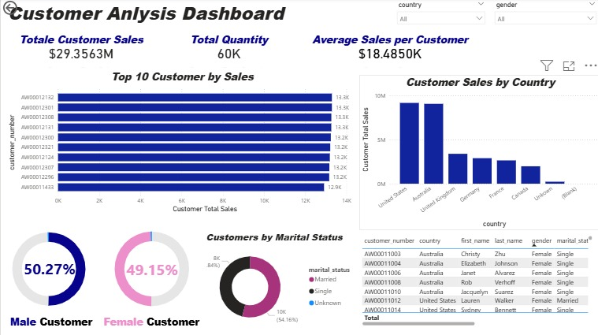
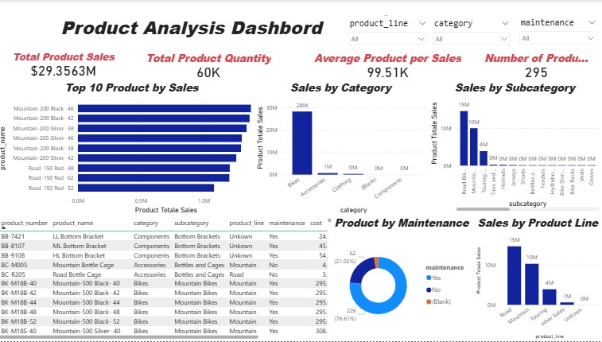

# Airflow Spark CRM ERP Analytics

> End-to-end data engineering project that turns raw CRM and ERP files into business-ready data and Power BI dashboards.

## Project Snapshot

- **Sources:** CRM + ERP CSV files  
- **Orchestration:** Apache Airflow  
- **Processing:** Apache Spark + Scala  
- **Storage:** HDFS + PostgreSQL  
- **Analytics:** Power BI

## What I Built

- Ingested raw CRM and ERP data into a **bronze** layer
- Cleaned and standardized data in a **silver** layer
- Built a **gold** layer with a star schema for analytics
- Published business-ready views for **Power BI**

## Architecture

## End-to-End Data Pipeline in Airflow

## Dashboards

### Sales Overview

### Customer Analysis

### Product Analysis

## Tech Stack

`Docker` `Apache Airflow` `Apache Spark` `Scala` `Python` `Hadoop HDFS` `PostgreSQL` `Power BI`

## Pipeline Flow

| Layer | Goal |
|---|---|
| **Bronze** | Store raw batch data |
| **Silver** | Clean, standardize, and enrich data |
| **Gold** | Build analytics tables and reporting views |

## Repo Highlights

- **Airflow DAGs** orchestrate the ETL flow
- **Spark jobs** process and model the data
- **PostgreSQL** stores the gold warehouse
- **Power BI** consumes the final model for dashboards

## Connect with Me

  
  

